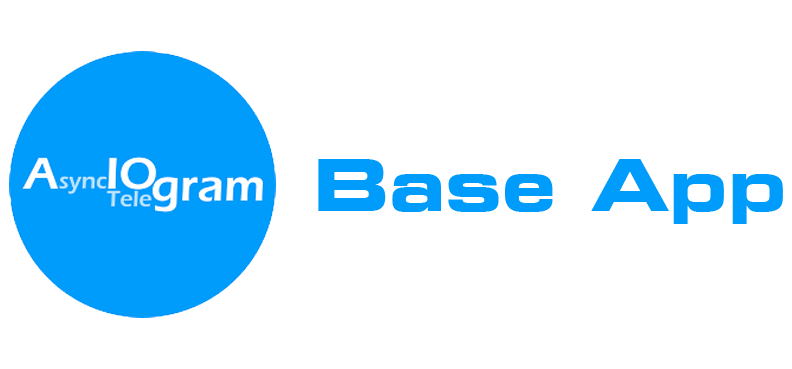

<p align="center">
  
</p>

[](https://www.python.org/)
[](https://aiogram.dev/)
[](https://www.sqlalchemy.org/)
[](https://www.postgresql.org/)
[](https://redis.io/)
[](https://docs.pydantic.dev/latest/)
[](https://redis.io/)
[](https://python-poetry.org/)
[](https://mypy-lang.org/)
[](https://docs.astral.sh/ruff/)
[](https://pre-commit.com/)
[](https://www.docker.com/)
[](https://docs.pytest.org/)
[](LICENSE.txt)

# Aiogram Base App 🚀

A lightweight and ready-to-use template for developing a Telegram bot using [**Aiogram**](https://github.com/aiogram/aiogram). Get started in minutes!

---

## 🌟 Why Choose This Template?

This starter kit is your fast track to building powerful Telegram bots with [**Aiogram**](https://github.com/aiogram/aiogram). Forget about:

- 🔧 Routine database setup
- ⚙️ Complex environment configuration
- 📂 Wasting time on project initialization and structure

---

## ✨ Core Tools

- 🛠️ **Type-safe code** with [**Mypy**](https://github.com/python/mypy) for reliable type checking
- 🧼 **Clean code** thanks to linter and formatter [**Ruff**](https://github.com/astral-sh/ruff)
- 📦 **Dependency management** with [**Poetry**](https://github.com/python-poetry/poetry) for convenience
- 🗃️ **High-performance database** using asynchronous [**SQLAlchemy**](https://github.com/sqlalchemy/sqlalchemy) and [**Asyncpg**](https://magicstack.github.io/asyncpg/current/) for [**PostgreSQL**](https://www.postgresql.org/)
- 🔄 **Simple database migrations** with [**Alembic**](https://github.com/sqlalchemy/alembic)
- ⚡ **Fast caching** with [**Redis**](https://github.com/redis/redis-py) for reliable FSM (storage)
- ⚙️ **Environment variable management** with [**Pydantic-settings**](https://github.com/pydantic/pydantic-settings)
- 📁 **Asynchronous file operations** via [**Aiofiles**](https://github.com/Tinche/aiofiles) for efficient handling
- 🛡️ **Code quality control** with [**Pre-commit**](https://github.com/pre-commit/pre-commit) hooks and Ruff for clean commits
- ✅ **Tests** with [**pytest**](https://github.com/pytest-dev/pytest) to test your code
- 🐳 **Docker image** for:
    - [**PostgreSQL**](https://hub.docker.com/_/postgres)
    - [**Redis**](https://hub.docker.com/_/redis)

---

## Requirements

- 🐍 Python 3.12+
- 📦 [Poetry](https://python-poetry.org/docs/#installation) (*optional*, for dependency management)
- 🐳 [Docker](https://www.docker.com/get-started) (*optional*, for running **Postgres** and **Redis**)

---

## Installation

### 1. Clone the Repository 📥

- Via `HTTPS`:
  ```bash
  git clone https://github.com/eugeneliukindev/Aiogram-Base-App.git
  ```

- Via `SSH` (*recommended*):
   ```bash
   git clone git@github.com:eugeneliukindev/Aiogram-Base-App.git
   ```

## 2. Install Dependencies ➕

- Using `Poetry` (*recommended*):
  - Full installation:
    ```bash
    poetry install
    ```
  
  - Install only main dependencies:
    ```bash
    poetry install --only main
    ```

- Using `pip`:
  ```bash
  pip install -r requirements.txt
  ```

---

### 3. Configure Environment Variables 🔑

Replace environment variables from [.env-template](.env-template) with `.env`

---


### 4. Launching Docker containers 🐳
```bash
docker compose --profile default up -d 
```

### 5. Alembic Migrations 🔄
Apply existing database migrations using Alembic:

```bash
alembic upgrade head
```

---

### 6. Run the Bot 🚀
```bash
python main.py
```

---

## Development Tools 🛠️

- Run `mypy .` for type checking
- Run `ruff check .` for linting
- Run `ruff format .` for code formatting
- Run `docker compose --profile test up -d` & `pytest` to run tests

---

## Additional Notes 📌

- **Important Note About `.env`** ⚠️

  The `.env` file is used to store sensitive data such as database settings, tokens, etc. For demonstration purposes, it is not added to `.gitignore`. For security, it is strongly recommended to add `.env` to `.gitignore` to avoid accidentally pushing sensitive data to the repository:
  ```bash
  echo ".env" >> .gitignore
  ```

- **Pre-commit Hook Initialization**

  If you've installed the `dev` dependencies and included `pre-commit`, activate it with:
  ```bash
  pre-commit install
  ```
- **Removing unnecessary files 🗑️**

  Most likely, these files and directories will be unnecessary in your project and can be safely deleted:
  - [**README.md**](README.md)
  - [**docs**](docs)

---

---

## Contributing 🤝

We welcome any improvements! To contribute:

1. Fork the repository
2. Create a new feature branch (`git checkout -b feature/YourFeature`)
3. Commit your changes (`git commit -m 'Add YourFeature'`)
4. Push the branch to the repository (`git push origin feature/YourFeature`)
5. Open a Pull Request

---

## License 📄

This project is licensed under the MIT License. See [LICENSE](LICENSE.txt) for details.

---

Happy coding! 🎉 If you have questions or need help, open an issue in the repository.